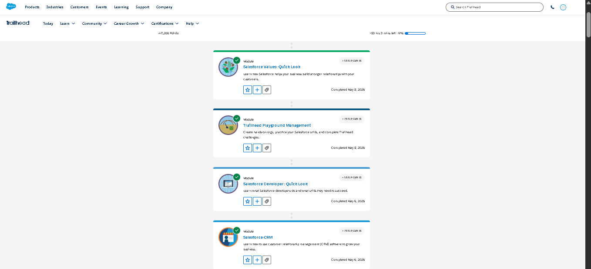
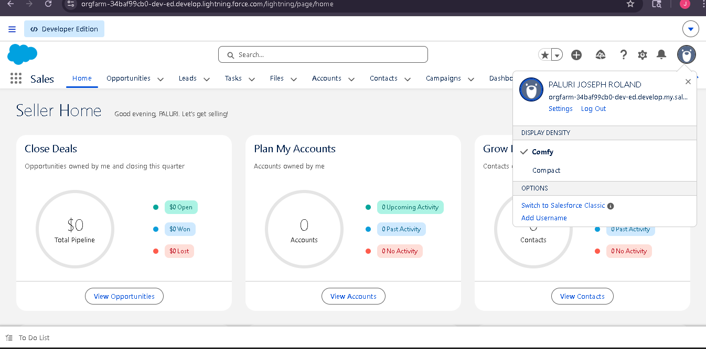
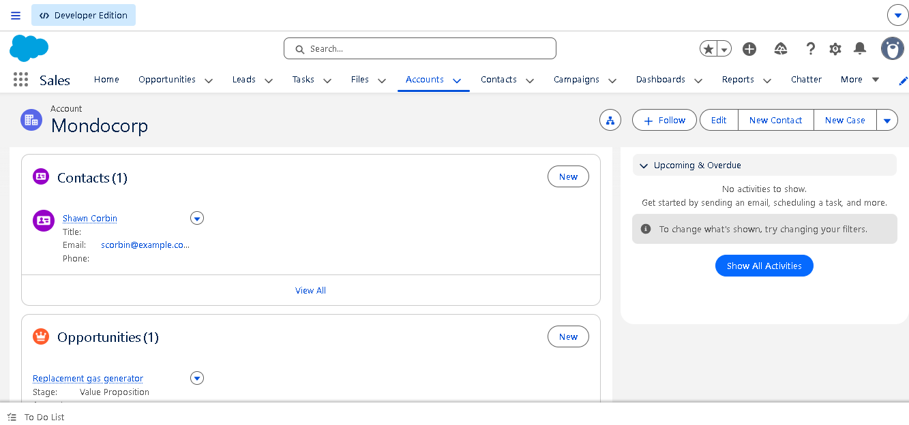
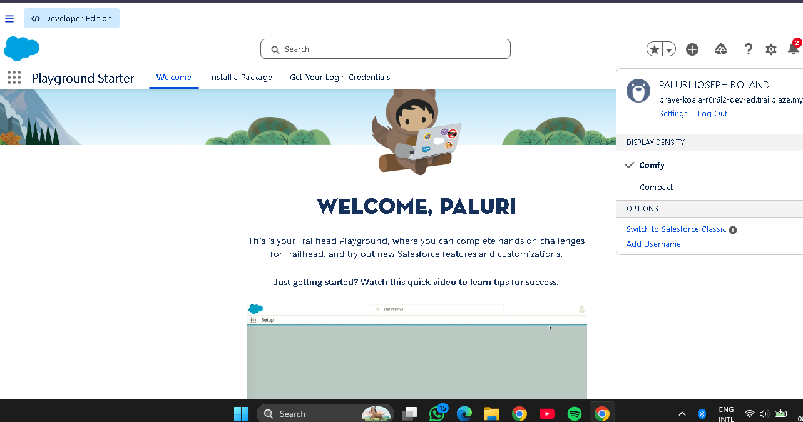

# Week 1 - Day 1 CRM Basics

## Introduction to Salesforce

Salesforce is a cloud-based Customer Relationship Management (CRM) platform used by organizations to manage customer relationships, sales, support services, marketing activities, and business workflows. It provides tools for automation, data management, analytics, and application development. Businesses use Salesforce to improve productivity, customer satisfaction, and overall business efficiency.

---

# What is CRM?

CRM stands for Customer Relationship Management. It is a technology and business strategy used by companies to manage customer information, interactions, communication, sales activities, and support services in one centralized system.

CRM helps organizations:
- Store and organize customer data
- Track customer interactions and communication
- Improve customer support and engagement
- Manage sales pipelines and opportunities
- Automate repetitive business tasks
- Increase productivity and efficiency

A CRM system allows different departments such as sales, marketing, and customer support to work together using shared customer information.

---

# Why Companies Use Salesforce

Companies use Salesforce because it helps them manage business operations efficiently through a single cloud-based platform.

### Benefits of Salesforce:
- Centralized customer information
- Automation of workflows and tasks
- Better sales and customer tracking
- Improved customer service
- Real-time reports and dashboards
- Secure cloud storage
- Scalability for growing businesses

Salesforce is widely used because it supports both low-code and custom application development, making it suitable for businesses of all sizes.

---

# Salesforce Concepts

## Account

An Account represents a company, organization, or customer in Salesforce. It stores important information related to a business entity.

### Example:
- College
- Hospital
- Company

---

## Contact

A Contact represents an individual person associated with an Account. It stores personal information such as:
- Name
- Email
- Phone number
- Address

### Example:
A student belonging to a college account.

---

## Opportunity

An Opportunity represents a potential business deal, transaction, or process that may generate value for the organization.

### Example:
- Student admission process
- Service contract
- Product purchase

Opportunities help organizations track progress and outcomes.

---

# Business Flow in Salesforce

Lead → Contact → Opportunity → Customer

### Explanation:

### Lead
A Lead is a potential customer or person who shows interest in a product or service.

### Contact
After qualification, the Lead becomes a Contact with verified information.

### Opportunity
An Opportunity is created when there is a possible business transaction or process.

### Customer
When the process or transaction is completed successfully, the person becomes a customer.

This workflow helps businesses manage and track customer relationships effectively.

---

# Real-World Mapping (College Admission System)

| Salesforce Concept | Real-World Example |
|---|---|
| Account | College |
| Contact | Student |
| Lead | Student applying for admission |
| Opportunity | Admission process and fee payment |

### Explanation

In a college admission system:
- The college acts as the Account.
- Students are stored as Contacts.
- New applicants are treated as Leads.
- The admission process becomes an Opportunity.

Salesforce can automate the entire admission workflow, including communication, document tracking, fee management, and notifications.

---

# Screenshots

## Trailhead Modules

---

## Playground Creation

---

## Playground Hands-on

---

## Playground Starter

