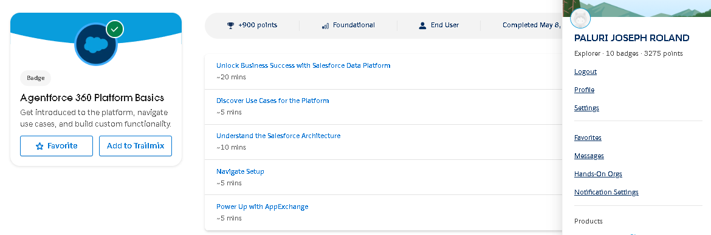
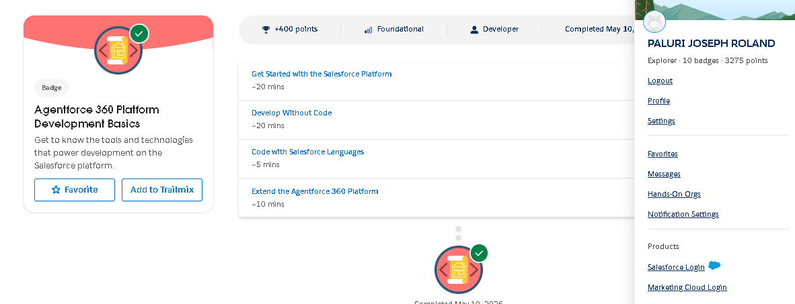

# Week 1 - Day 2 Platform Basics

# 1. What is Salesforce Platform?

The Salesforce Platform is a cloud-based application development platform that allows businesses and developers to build, customize, and manage applications using Salesforce tools and services. It provides features such as data storage, automation, security, analytics, APIs, and user interface components.

The platform allows organizations to manage CRM processes while also creating custom business applications without building everything from scratch.

Salesforce supports:
- Low-code configuration
- Custom development using Apex
- APIs and integrations
- Automation and workflows
- Cloud-based scalability

---

# 2. Salesforce Concepts

## What is an App?

An App in Salesforce is a collection of related tabs, objects, and features grouped together for a specific business purpose.

### Example:
- Sales App
- Service App
- College Management App

Apps help users access related tools and data from one place.

---

## What is an Object?

An Object is a database table used to store specific types of information in Salesforce.

Objects contain:
- Records (rows)
- Fields (columns)

### Examples:
- Account
- Contact
- Opportunity
- Student (custom object)

Objects help organize and manage business data.

---

## What is a Tab?

A Tab is a user interface element that allows users to access objects, records, dashboards, reports, or applications.

Tabs help users navigate inside Salesforce.

### Example:
- Accounts Tab
- Contacts Tab
- Students Tab

---

# 3. Difference Between Configuration and Coding

| Configuration | Coding |
|---|---|
| Uses low-code tools | Uses programming |
| Faster to implement | Used for advanced logic |
| Managed using clicks | Managed using Apex and JavaScript |
| Easier maintenance | More customization |

---

## When to Use Configuration

Configuration should be used when business requirements can be solved using Salesforce’s built-in tools without writing code.

### Examples:
1. Creating workflows using Flow Builder
2. Creating validation rules for forms

---

## When to Use Coding (Apex)

Coding should be used when advanced customization or complex business logic is required.

### Examples:
1. Integrating Salesforce with external systems using APIs
2. Creating complex automation that cannot be handled by Flow

---

# 4. Connecting CRM Concepts to Salesforce Platform

CRM concepts like Account, Contact, and Opportunity are implemented as Objects inside Salesforce Apps.

### Example:
- Account stores organization details
- Contact stores individual customer information
- Opportunity stores possible business deals

These objects are displayed through Tabs and grouped inside Apps to create complete business systems.

---

# 5. Real System Design (College Management System)

## App Name
College Management App

---

## Objects Inside the App

| Object | Purpose |
|---|---|
| Student | Store student details |
| Faculty | Store teacher information |
| Course | Store course details |
| Attendance | Manage attendance |
| Fees | Track fee payments |

---

## User Interaction

### Students
- View course details
- Check attendance
- Receive notifications

### Faculty
- Manage attendance
- Update student records
- Upload marks

### Admin
- Manage all records
- Generate reports
- Monitor operations

---

# 6. Multi-Tenant Architecture

Salesforce uses a multi-tenant architecture, which means multiple organizations share the same infrastructure and servers while keeping their data secure and separated.

This allows Salesforce to:
- Reduce infrastructure costs
- Provide automatic updates
- Scale efficiently
- Maintain security for each organization

---

# 7. How Developers Extend Salesforce

Developers extend Salesforce functionality using:
- Apex programming
- Lightning Web Components (LWC)
- APIs and integrations
- Custom objects and applications
- Automation tools

This allows businesses to build custom solutions on top of the Salesforce Platform.

---

# 8. What I Learned Today

- Understood Salesforce Platform architecture
- Learned Apps, Objects, and Tabs
- Learned difference between configuration and coding
- Understood multi-tenant architecture
- Learned how developers customize Salesforce

---

# Screenshots

## Platform Basics Module

---

## Platform Development Basics Module

